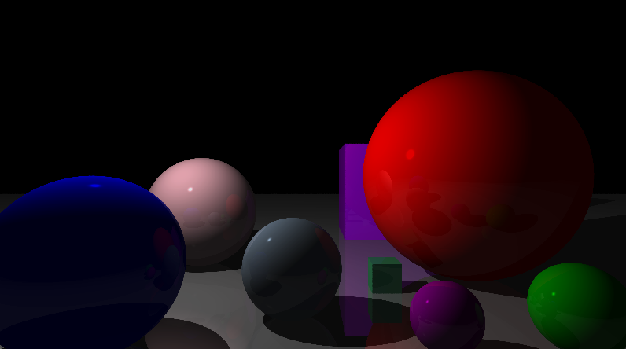
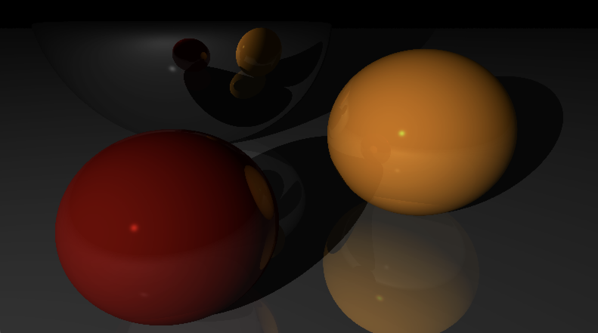
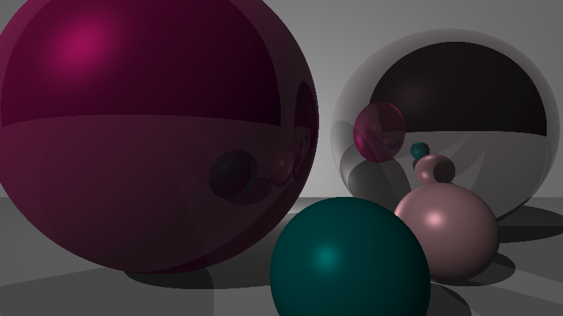

A 3D rendering engine built in Rust, developed without external graphics or math libraries (except for the the basic functionalities of rendering a pixel buffer to the screen and capturing keyboard input). The engine employs a multithreaded ray tracing algorithm to efficiently render 3D scenes to the screen.

At it's core, the ray tracer supports rendering spheres and triangles, which can be composed into more complex objects. It supports multiple types of light sources (ambient, point, and directional) as well as reflections and shadows for realistic rendering. Objects can have matte or shiny surfaces (with additional properties) and surface-light interactions are simulated accordingly through diffuse and specular reflection models. The rendering loop supports camera movement and rotation controlled via keyboard inputs, allowing users to navigate through the 3D scene.

### Examples:

### Resources:

- https://www.gabrielgambetta.com/computer-graphics-from-scratch/index.html
- https://raytracing.github.io/books/RayTracingInOneWeekend.html
